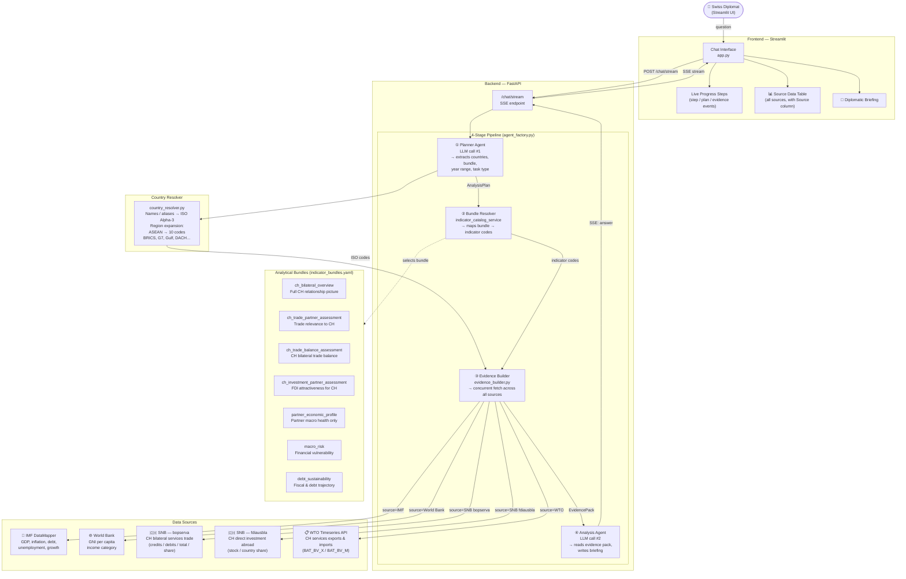

# Gov Tech Hackathon - AIDA

AIDA is **AI Diplomatic Assistant** for Swiss diplomats that answers economic and bilateral questions from a Swiss perspective by fetching live data from IMF, World Bank, SNB, and WTO APIs. It runs every question through a four-stage pipeline — planner, bundle resolver, evidence builder, and analysis agent — ensuring the LLM only synthesises answers from verified structured data, never raw API responses. The result is a concise diplomatic briefing with a source-labelled evidence table, covering macro risk, trade, FDI, and bilateral overviews for any country or region worldwide.


---


# Architecture



The LLM never calls any API directly and never sees raw HTTP responses. It only reads the structured evidence pack when writing the final answer.

---

## Data Sources & Indicators

### Level 1 — Partner Country Economics

| Indicator | Code | Source | Unit | Used in |
|---|---|---|---|---|
| Real GDP growth | `NGDP_RPCH` | [IMF DataMapper](https://data.imf.org/en/datasets/IMF.RES:WEO) | % change | All bundles |
| GDP, current prices | `NGDPD` | IMF DataMapper | Billions USD | All bundles |
| GDP per capita | `NGDPDPC` | IMF DataMapper | USD per person | All bundles |
| Inflation, avg consumer prices | `PCPIPCH` | IMF DataMapper | % change | Most bundles |
| Unemployment rate | `LUR` | IMF DataMapper | % of labour force | bilateral_overview, economic_profile |
| Government gross debt | `GGXWDG_NGDP` | IMF DataMapper | % of GDP | Most bundles |
| Fiscal balance | `GGXCNL_NGDP` | IMF DataMapper | % of GDP | investment, economic_profile |
| Current account balance | `BCA_NGDPD` | IMF DataMapper | % of GDP | investment, economic_profile |
| GNI per capita (Atlas) | `NY.GNP.PCAP.CD` | [World Bank API v2](https://datahelpdesk.worldbank.org/knowledgebase/articles/898590) | Current USD | bilateral_overview, economic_profile |

> IMF data covers 2015–2027 (includes WEO forecasts). Country codes follow ISO Alpha-3.

### Level 2 — Switzerland Bilateral Services Trade

| Indicator | Code | Source | Unit | Used in |
|---|---|---|---|---|
| CH services trade receipts (credits) | `bopserva_credits` | [SNB — bopserva cube](https://data.snb.ch/en/topics/aub/chart/bopserva) | Millions CHF | trade_assessment |
| CH services trade payments (debits) | `bopserva_debits` | SNB — bopserva | Millions CHF | trade_assessment |
| CH services trade total | `bopserva_total` | SNB — bopserva | Millions CHF | trade_assessment, bilateral_overview |
| Partner share of CH services trade | `bopserva_share` | SNB — bopserva | % | trade_assessment, bilateral_overview |
| CH services exports (WTO BaTiS) | `BAT_BV_X` | [WTO Timeseries API](https://timeseries.wto.org/) | Million USD | trade_assessment, bilateral_overview |
| CH services imports (WTO BaTiS) | `BAT_BV_M` | WTO Timeseries API | Million USD | trade_assessment, bilateral_overview |

### Level 3 — Switzerland Direct Investment Abroad

| Indicator | Code | Source | Unit | Used in |
|---|---|---|---|---|
| Swiss FDI stock in partner country | `fdiausbla_stock` | [SNB — fdiausbla cube](https://data.snb.ch/en/topics/aub/chart/fdiausbla) | Millions CHF | investment_assessment, bilateral_overview |
| Partner share of total Swiss FDI | `fdiausbla_share` | SNB — fdiausbla | % | investment_assessment, bilateral_overview |

---

## Analytical Bundles

The planner agent automatically selects the most appropriate bundle based on the question:

| Bundle | Planner selects when… | Sources used |
|---|---|---|
| `ch_bilateral_overview` | "Tell me about Vietnam" / "Overview of India" | IMF + World Bank + SNB (services + FDI) + WTO |
| `ch_trade_partner_assessment` | "How important is India as a trade partner?" | IMF + SNB (services) + WTO |
| `ch_trade_balance_assessment` | "What is the trade balance with the US?" | WTO (BAT_BV_X / BAT_BV_M) |
| `ch_investment_partner_assessment` | "Investment climate in Indonesia?" | IMF + World Bank + SNB (FDI) |
| `partner_economic_profile` | "Is Egypt financially stable?" | IMF + World Bank |
| `macro_risk` | "Is Argentina vulnerable?" | IMF |
| `debt_sustainability` | "Assess Kenya's debt" | IMF |

---

## Project Structure

```
app/v1/
  agents/
    planner_agent.py      — LLM call #1: question → AnalysisPlan (structured output)
    analysis_agent.py     — LLM call #2: evidence pack → diplomatic briefing
    agent_factory.py      — orchestrates the full pipeline; yields SSE progress events
  services/
    indicator_catalog_service.py  — loads indicator_catalog.yaml and indicator_bundles.yaml
    country_resolver.py           — maps country/region names → ISO Alpha-3 codes
    imf_client.py                 — HTTP client for IMF DataMapper REST API
    worldbank_client.py           — HTTP client for World Bank REST API v2
    snb_client.py                 — HTTP client for SNB cube API (bopserva, fdiausbla)
    wto_client.py                 — WTO Timeseries API client (requires WTO_SUBSCRIPTION_KEY)
    evidence_builder.py           — routes each indicator to its source client, returns EvidencePack
  tools/
    adls_tools.py         — Azure Data Lake tools (list, read, write, delete files)
  schemas/
    planning.py           — AnalysisPlan Pydantic model
    evidence.py           — EvidencePack + IndicatorRecord Pydantic models
  config.py               — pydantic-settings; reads all env vars from .env
  main.py                 — FastAPI; exposes /chat (blocking) and /chat/stream (SSE)

data/yaml/
  indicator_catalog.yaml   — all indicators with source routing metadata
  indicator_bundles.yaml   — 7 analytical bundles (Switzerland-centric)
  country_groups.yaml      — 80+ country aliases + 10 region groups

frontend/
  app.py      — Streamlit chat UI; consumes SSE stream, shows steps + evidence table
  config.py   — frontend settings (BACKEND_URL)
```

---

# Example Questions

**Full bilateral overview**
> "Give me a full overview of Switzerland's relationship with Vietnam."
> "Prepare a country briefing on India for the State Secretariat."

Uses `ch_bilateral_overview`. Returns IMF macro profile + Swiss services trade (SNB) + Swiss FDI (SNB).

---

**Trade partner assessment**
> "How important is Germany as a trade partner for Switzerland?"
> "Should Switzerland deepen trade ties with Indonesia?"
> "Compare Vietnam, Thailand, and Malaysia as Swiss export markets."

Uses `ch_trade_partner_assessment`. Combines partner economic fundamentals with Swiss bilateral goods and services trade data.

---

**Investment partner assessment**
> "Assess the investment climate in Nigeria from a Swiss perspective."
> "Is Egypt an attractive destination for Swiss FDI?"
> "Compare investment risk in Brazil versus Argentina."

Uses `ch_investment_partner_assessment`. Highlights economic stability, income level, and existing Swiss FDI position.

---

**Partner economic profile**
> "What is Vietnam's economic situation?"
> "Is Turkey financially stable?"

Uses `partner_economic_profile`. IMF + World Bank data on growth, inflation, debt, current account, and income level.

---

**Macro risk**
> "Is Argentina financially vulnerable?"
> "Assess macro risks in Ghana."

Uses `macro_risk`. Focuses on inflation, fiscal balance, debt, and external account signals.

---

**Debt sustainability**
> "Is Sri Lanka's debt sustainable?"
> "Review Kenya's fiscal position."

Uses `debt_sustainability`. GDP growth trajectory against debt-to-GDP, deficit, and current account.

---

**Regional questions**
> "Give me a macro overview of ASEAN."
> "Which BRICS country has the strongest growth outlook for Swiss investment?"
> "How exposed is Switzerland to the Gulf region?"

The country resolver expands region names (e.g. `asean` → 10 ISO codes, `brics`, `g7`, `gulf`, `dach`) automatically.

---


# Setup

## Configure the Python environment
<details>
<summary>Click to expand</summary>

- Install `uv`: 

```bash
pip install uv==0.8.14
```

- Create virtual environment: 
```bash
uv venv .venv --python 3.12.11
```

- Activate with: 
```bash
source .venv/Scripts/activate
```

- Install the libraries (including dev): 
```bash
uv pip install -r pyproject.toml

- Install pre-commit: 
```bash
pre-commit install
```

- Adding the environment file
Copy the `env.example` file into `.env` file. Fill in the environment variables.

</details>

## Make Commands

| Command | Description |
|---|---|
| `make run-backend` | Start the FastAPI agent server on `http://localhost:8000` |
| `make run-frontend` | Start the Streamlit chat UI on `http://localhost:8501` |
| `make run` | Start both backend and frontend simultaneously |
| `make download_imf_data` | Download IMF GDP growth data to `data/imf/` |
| `make docker-build` | Build both Docker images locally |
| `make docker-run` | Build and start both containers via Docker Compose |
| `make docker-down` | Stop and remove containers |
| `make deploy-azure` | Build images locally, push to ACR, deploy to Azure Container Apps (`switzerlandnorth`) |

---

## Running locally (Python)

**Backend only:**

```bash
make run-backend
```

**Frontend only** (requires backend already running):

```bash
make run-frontend
```

**Both at once:**

```bash
make run
```

- Backend API + docs: `http://localhost:8000/docs`
- Chat UI: `http://localhost:8501`

---

## Running locally (Docker)

Requires Docker Desktop. Mirrors the Azure topology exactly.

```bash
make docker-run
```

This builds both images and starts:
- Frontend → `http://localhost:8501`
- Backend → `http://localhost:8000`

The frontend container automatically points to the backend container via Docker's internal network (`http://backend:8000`). Your `.env` file is used for all secrets — it is never baked into the image.

To stop:

```bash
make docker-down
```

---

## Deploying to Azure (Container Apps)

Hosted on **Azure Container Apps** in `switzerlandnorth`. The backend runs with internal ingress (not reachable from the internet directly); only the Streamlit frontend is public. Secrets are stored in Container Apps and injected at runtime.

### Prerequisites

```bash
# One-time setup
az login
az extension add --name containerapp --upgrade
```

### Deploy

Requires Docker Desktop. The script reads secrets directly from your `.env` file — no manual `export` needed. Fully idempotent — safe to run again to redeploy after code changes.

```bash
make deploy-azure
```

The script will:
1. Register required Azure resource providers (one-time, no-op thereafter)
2. Create a resource group (`edatademo-rg`) in `switzerlandnorth` if not present.
3. Create an Azure Container Registry if not present, build both images locally, and push them
4. Create a Container Apps environment
5. Deploy the **backend** with internal ingress (port 8000)
6. Deploy the **frontend** with external ingress (port 8501), wired to the backend URL
7. Print the public demo URL

### Tear down after the demo

```bash
az group delete --name edatademo-rg --yes --no-wait
```

---

**Both at once:**

## API Reference

### Health check

```bash
curl http://localhost:8000/health
```

```json
{"status": "ok"}
```

---

# Chat with the agent

**Single turn:**

```bash
curl -X POST http://localhost:8000/chat \
  -H "Content-Type: application/json" \
  -d '{"message": "List all files in the raw/ directory"}'
```

**Multi-turn (pass prior history):**

```bash
curl -X POST http://localhost:8000/chat \
  -H "Content-Type: application/json" \
  -d '{
    "message": "Now read the first file you found",
    "history": [
      {"role": "human", "content": "List all files in the raw/ directory"},
      {"role": "ai",    "content": "I found the following files: raw/data.csv"}
    ]
  }'
```

**Response shape:**

```json
{"response": "<agent answer>"}
```

---
